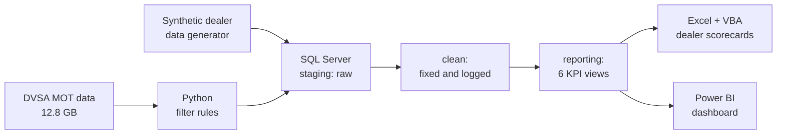
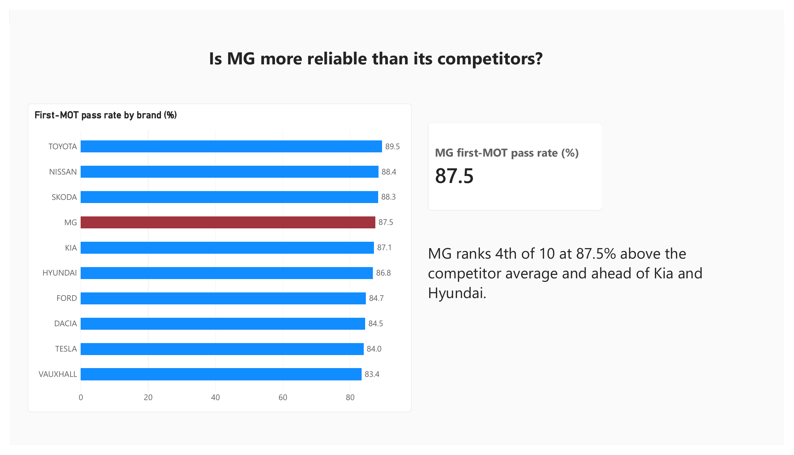
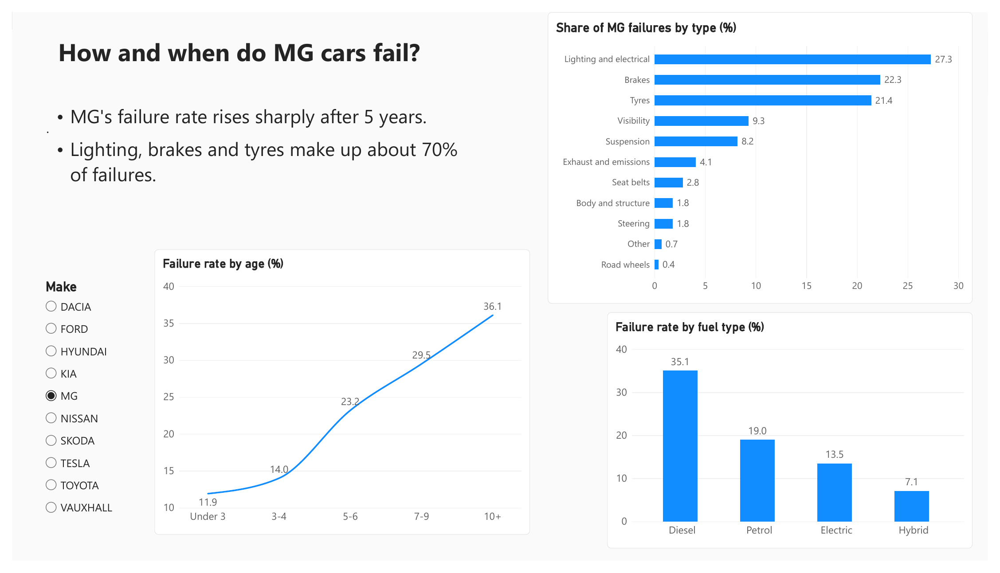
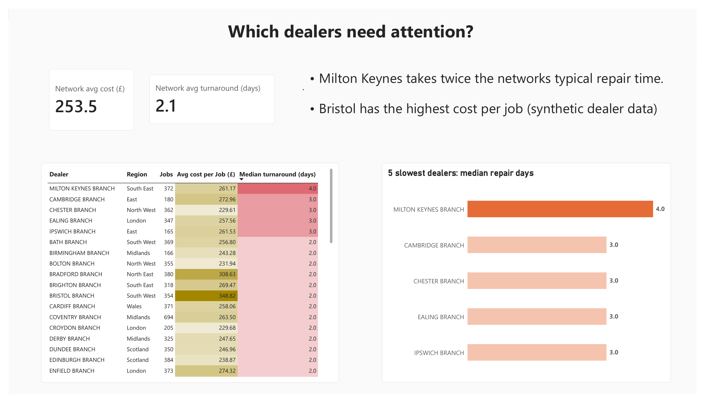

# UK Aftersales Analytics: MG Reliability and Dealer Performance

An end-to-end analytics project for a car brand's aftersales team. It answers two questions:

1. **How reliable are MG cars compared with the market?** Using about 12 million real UK MOT tests (2024) for MG and 9 competitors.
2. **How well does the dealer network handle repairs?** Using synthetic dealer data (real dealer data is confidential).

**Tools:** Python, SQL Server (T-SQL), Excel + VBA, Power BI

---

## Key findings

| Finding | Detail |
|---|---|
| MG passes its first MOT **87.5%** of the time | 4th of 10 brands, about 1.3 points above the competitor average; ahead of Kia and Hyundai, behind Toyota (89.5%) |
| MG ages less well in the middle years | At 5 to 6 years old MG fails 23.2% of MOTs vs 18.5% for competitors (9th of 10) |
| MG's top failures: lighting, brakes, tyres | Together about 70% of MG failures; MG's tyre share is 2nd highest after Tesla |
| Two dealers stand out | Milton Keynes takes 4 days to repair a car, twice the network's typical 2 days; Bristol has the highest cost per job at £349 vs a £254 average (synthetic data) |
| A third of the raw data was duplicated | 32% of MOT rows were repeats; without cleaning, every KPI would have been inflated |

---

## How it works

| Step | What happens | Files |
|---|---|---|
| 1. Plan | Business questions and 6 KPI definitions | `docs/Business_brief.md`, `docs/data_dictionary.md` |
| 2. Extract and filter | Python reads the MOT zips in 1-million-row chunks and keeps only cars, the 10 brands, normal tests and the needed columns (12.8 GB to 17.6m rows; about 12m unique tests after removing duplicates in SQL) | `python/01_filter_mot.py` |
| 3. Synthetic dealer data | 50 dealers and 20,300 repair jobs, with planted data problems and an answer key | `python/02_generate_dealers.py`, `data/synthetic/` |
| 4. Load | Raw data bulk-loaded into SQL Server `staging`; row counts reconciled with the files | `sql/00` to `sql/02` |
| 5. Profile | Data quality problems measured before fixing | `sql/03_profile_staging.sql` |
| 6. Clean | Duplicates removed, fuel codes standardised, names tidied, invalid dates flagged; every fix logged | `sql/04_clean.sql` |
| 7. KPIs | Six KPIs saved as SQL views in the `reporting` schema | `sql/05_kpi_views.sql` |
| 8. Excel report | One-page dealer scorecard (INDEX/MATCH); a VBA macro exports a PDF for each of the 50 dealers | `excel/` |
| 9. Power BI | Three-page dashboard: MG vs the market, failure patterns, dealer performance | `powerbi/` |

---

## Power BI dashboard

Three pages, each answering one question. The Make slicer on page 2 lets you compare any brand with MG.

[Watch the 45-second demo](powerbi/dashboard_demo.mp4) · [Full report as PDF](powerbi/aftersales_dashboard.pdf)

**1. Is MG more reliable than its competitors?**

**2. How and when do MG cars fail?**

**3. Which dealers need attention?**

---

## The 6 KPIs

1. First-MOT pass rate by make
2. Failure rate by vehicle age
3. Top failure categories (brakes, tyres, lighting...)
4. Failure rate by fuel type (EV vs petrol vs diesel)
5. Average repair cost per dealer
6. Median repair time per dealer (median, because a few long parts delays distort the mean)

---

## Data quality

Problems were measured first, then fixed, and every fix is recorded in `clean.data_quality_log`.

| Problem | Rows | Fix |
|---|---|---|
| Duplicate MOT tests | 5,618,555 (32%) | Kept one row per test (`ROW_NUMBER`) |
| Fuel type stored as text instead of codes | 466,097 | Mapped into 5 fuel groups |
| Duplicate dealer jobs | 300 | Removed (`DISTINCT`) |
| Messy dealer names | 6 | Trimmed and standardised |
| Jobs closed before they were opened | 120 | Flagged and excluded from repair times |

The dealer cleaning found **exactly** the problems planted by the generator (see `data/synthetic/answer_key.txt`), which proves the cleaning works.

---

## Data

| Data | Source | In this repo? |
|---|---|---|
| MOT test results and failure items, 2024 | DVSA anonymised MOT data (open government data) | No, about 13 GB. Download it and run the Python script |
| MOT lookup tables (failure categories) | DVSA, same download page | No |
| Dealers and service jobs | Synthetic, generated by `python/02_generate_dealers.py` | Yes, `data/synthetic/` |

## How to run it

1. Download the DVSA MOT results, failure items and lookup zips (2024) into `data/raw/`.
2. `python python/01_filter_mot.py` and `python python/02_generate_dealers.py`
3. Run SQL Server (Docker on Mac), then the scripts in `sql/` in number order: `00` to `05`.
4. Export `reporting.vw_dealer_scorecard` to `excel/dealer_scorecard.csv`, open `excel/dealer_scorecard.xlsm` and run the `ExportDealerPDFs` macro.
5. Open `powerbi/aftersales_dashboard.pbix` in Power BI Desktop (Windows). It reads the CSV exports in `powerbi/data/`.

---

## Limitations

- Dealer data is synthetic, so the dealer findings demonstrate the method, not real dealer performance.
- About 96,000 MOT tests (under 1%) appeared in two slightly different versions; one was kept. This does not change the results.
- Age is measured in whole years (months ÷ 12, rounded down). Cars can take their first MOT up to a month early, so the "Under 3" band is mostly early first MOTs, which KPI 1 (age 3) leaves out.
- The fuel comparison is not adjusted for age: EVs are younger cars, so they naturally fail less. MG's diesel result is based on only 828 tests of older cars.
- MOT results reflect cars that were tested, so they measure roadworthiness at the test, not every fault a car has had.

---

**Author:** Salman Khalid, MSc Business Analytics (UCL)
